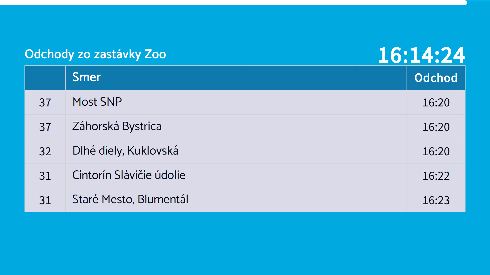

# BananaTV #

BananaTV is a digital signage system developed as a bachelor project for Faculty of Informatics and Information Technologies, Slovak Univrsity of Technology. The system is based on WordPress and consists of several modules.

## Features ##

* Grouping pages into sequences 
* Controlling screens connected through HDMI
* Displaying timetables from AIS (Academic Information System) of Slovak University of Technology
* Displaying public transport schedules in Bratislava, Slovakia
* Displaying weather using Openweathermap and local weather sensor
* Displaying snapshots from CCTV cameras 
* Displaying posters and webpages of various formats

## Installing ##

System is installed by enabling all provided modules in `wp-content/plugins` directory. 
Some plugins require installation of additional php modules:

* php-zip
* php-imagick
* php-curl

System can also be easily deployed using provided `docker-compose` file. 

